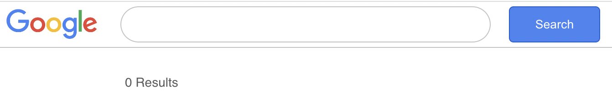
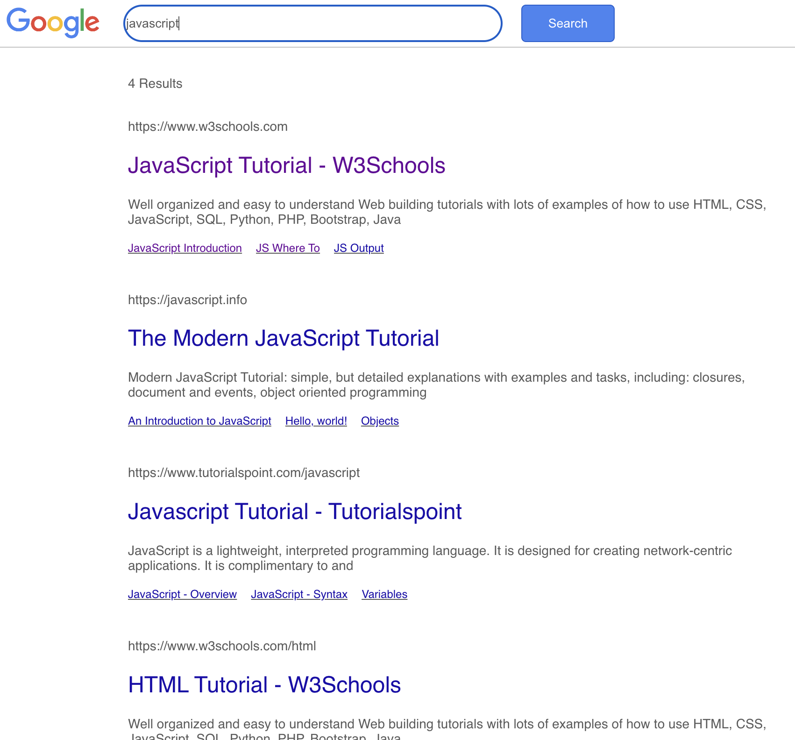

# React Google Search Copy

This is a React application that mimics the functionality of Google Search. Users can enter a search term, and the application will display the search results that match the term.

## Screenshots

#### Empty Search Bar

#### Search Results

## Getting Started

To get started with the React Google Search Copy, follow these steps:

1. Clone the repository:

2. Navigate to the project directory:

3. Install the dependencies:

4. Start the development server:

The application will be available at `http://localhost:3000` in your browser.

## Usage

1. Enter a search term in the search bar.
2. Press the Enter key or click the "Search" button.
3. The application will display the search results.

## Components

### App Component

The `App` component is the main component of the application. It manages the search functionality and displays the search results.

#### State

- `results`: An array of search results.
- `searchTerm`: The current search term entered by the user.

#### Methods

- `setValue(str)`: Updates the `searchTerm` state with the provided string.
- `search(e, str)`: Handles the search functionality. It prevents the default form submission, checks if the search bar is empty, and calls the `apiSearch` method to fetch the search results from the API.
- `apiSearch()`: Sends a GET request to the API with the current `searchTerm` and updates the `results` state with the retrieved search results.

#### Rendering

The `App` component renders a navigation bar with a logo and a search bar. It also displays the number of search results and a list of search result components (`Result`) for each item in the `results` array.

### Result Component

The `Result` component is a child component of `App` and represents a single search result.
